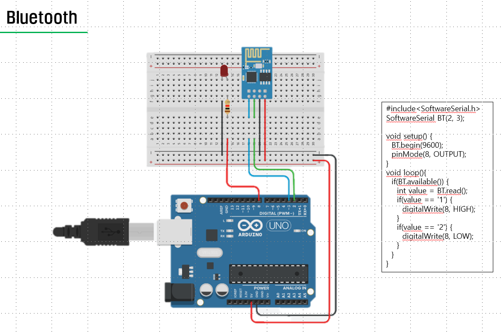
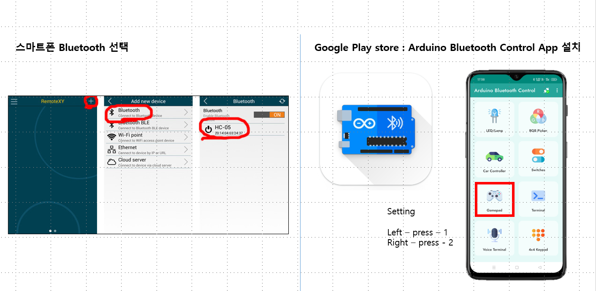
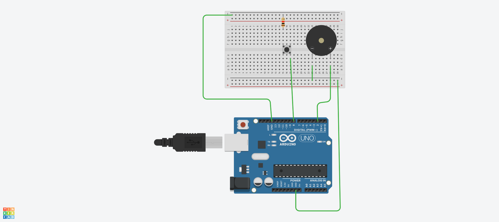
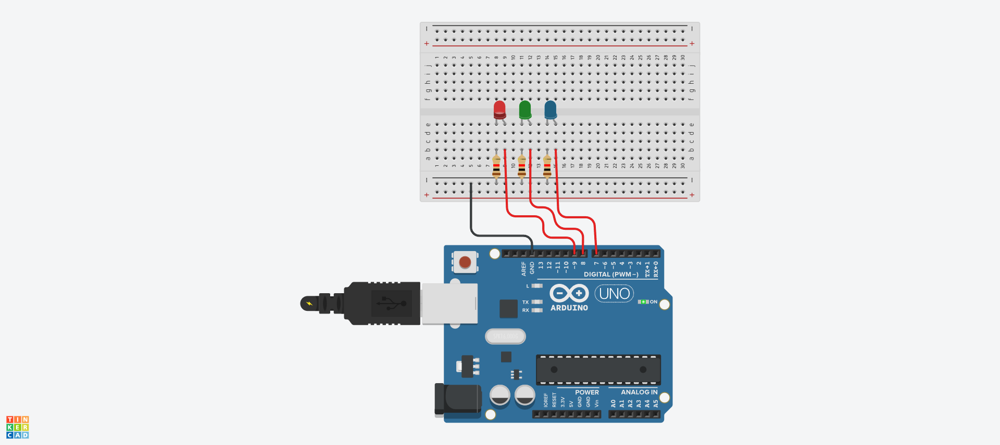
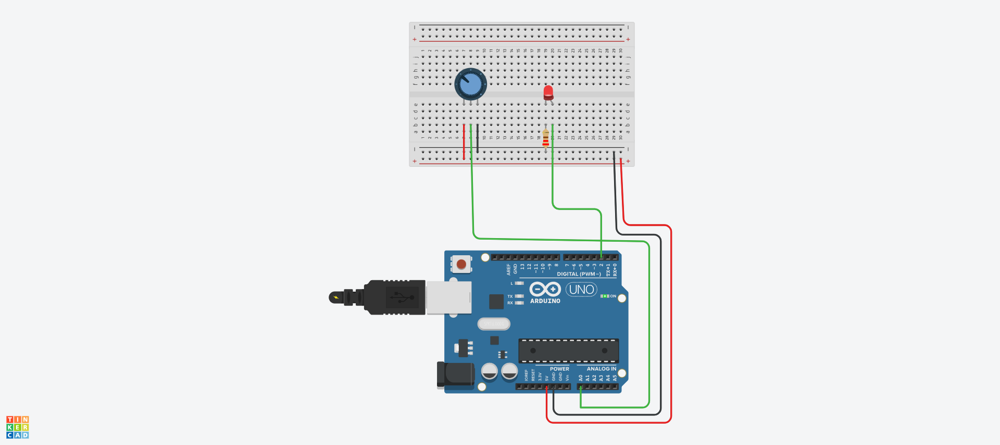

```C
#include<SoftwareSerial.h>
SoftwareSerial BT(2, 3);

void setup() {
  BT.begin(9600);
  pinMode(8, OUTPUT);
}
void loop(){
  if(BT.available()) {
    int value = BT.read();
    if(value == '1') {
      digitalWrite(8, HIGH);
    }
    if(value == '2') {
      digitalWrite(8, LOW);
    }
  }
}
```



```c
const int buttonPin = 8;    // 버튼 핀
const int buzzerPin = 2;    // 부저 핀

bool buzzerState = false;        // 부저의 현재 ON/OFF 상태 저장
bool lastButtonState = HIGH;     // 이전 버튼 상태 (초기에는 HIGH)

void setup() {
  pinMode(buttonPin, INPUT_PULLUP);  // 버튼 입력, 내부 풀업 사용
  pinMode(buzzerPin, OUTPUT);        // 부저 출력 모드 설정
  digitalWrite(buzzerPin, LOW);      // 초기에는 부저 OFF
}

void loop() {
  bool currentButtonState = digitalRead(buttonPin);  // 현재 버튼 상태 읽기

  // 눌림 순간 감지 (HIGH → LOW 변화 시 토글 실행)
  if (lastButtonState == HIGH && currentButtonState == LOW) {
    buzzerState = !buzzerState;  // 상태 반전
    digitalWrite(buzzerPin, buzzerState ? HIGH : LOW);  // 부저 ON/OFF
    delay(200);  // 디바운스 처리
  }

  lastButtonState = currentButtonState;  // 현재 상태를 이전 상태로 저장
}
```

```c
const int redPin = 9;
const int greenPin = 8;
const int bluePin = 7;


void setup(){
  pinMode(redPin, OUTPUT);
  pinMode(greenPin, OUTPUT);
  pinMode(bluePin, OUTPUT);
}

void loop() {
  digitalWrite(redPin, HIGH);
  digitalWrite(greenPin, LOW);
  digitalWrite(bluePin, LOW);
  delay(1000);
  digitalWrite(greenPin, HIGH);
  digitalWrite(redPin, LOW);
  digitalWrite(bluePin, LOW);
  delay(1000);
  digitalWrite(bluePin, HIGH);
  digitalWrite(redPin, LOW);
  digitalWrite(greenPin, LOW);
  delay(1000);
}
```    

```c
const int potPin = A0;     // 가변저항 중앙 핀 (아날로그 입력)
const int ledPin = 2;      // PWM 출력 핀에 연결된 LED

void setup() {
  pinMode(ledPin, OUTPUT);
}

void loop() {
  int potValue = analogRead(potPin);              // 0~1023 입력
  int brightness = map(potValue, 0, 1023, 0, 255); // 0~255로 변환
  analogWrite(ledPin, brightness);                // LED 밝기 조절
  delay(10);
}
```

## 배열을 이용하여 학생 10명의 수학 점수를 입력받고, 최고 점수와 최저 점수를 출력하는 프로그램을 완성하시오.
```c
#include <stdio.h>

int main() {
    int scores[10];        // 학생 10명의 점수를 저장할 배열
    int max, min;          // 최고 점수와 최저 점수를 저장할 변수

    // 점수 입력
    printf("학생 10명의 수학 점수를 입력하세요:\n");
    for (int i = 0; i < 10; i++) {
        printf("%d번 학생 점수: ", i + 1);
        scanf("%d", &scores[i]);
    }

    // 초기 최고/최저 값 설정
    max = min = scores[0];

    // 최고점 및 최저점 찾기
    for (int i = 1; i < 10; i++) {
        if (scores[i] > max) {
            max = scores[i];
        }
        if (scores[i] < min) {
            min = scores[i];
        }
    }

    // 결과 출력
    printf("최고 점수: %d\n", max);
    printf("최저 점수: %d\n", min);

    return 0;
}
```

## 배열 int data[6] = {1, 2, 3, 4, 5, 6}의 원소 순서를 {6, 5, 4, 3, 2, 1}로 뒤집는 프로그램을 작성하시오.
```c
#include <stdio.h>

int main() {
    int data[6] = {1, 2, 3, 4, 5, 6};
    int temp;

    // 배열을 뒤집는 로직 (앞뒤 교환)
    for(int i = 0; i < 6 / 2; i++) {
        temp = data[i];
        data[i] = data[5 - i];
        data[5 - i] = temp;
    }

    // 결과 출력
    printf("뒤집힌 배열: ");
    for(int i = 0; i < 6; i++) {
        printf("%d ", data[i]);
    }

    return 0;
}
```


