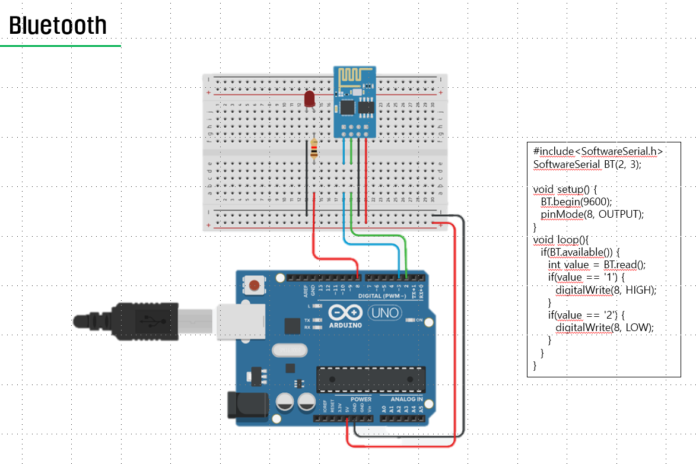

```C
#include<SoftwareSerial.h>
SoftwareSerial BT(2, 3);

void setup() {
  BT.begin(9600);
  pinMode(8, OUTPUT);
}
void loop(){
  if(BT.available()) {
    int value = BT.read();
    if(value == '1') {
      digitalWrite(8, HIGH);
    }
    if(value == '2') {
      digitalWrite(8, LOW);
    }
  }
}
```


