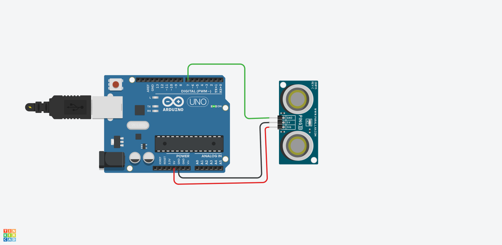
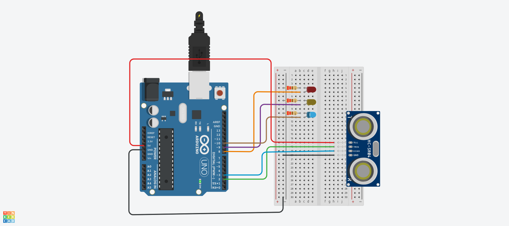
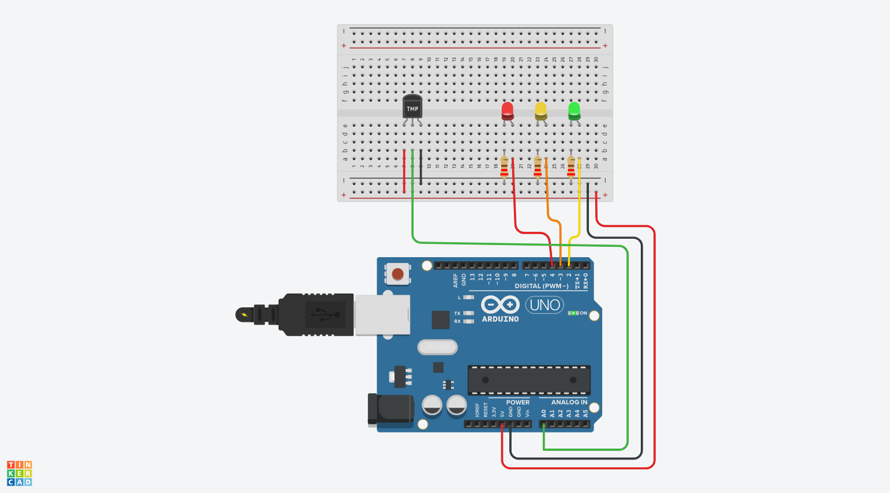
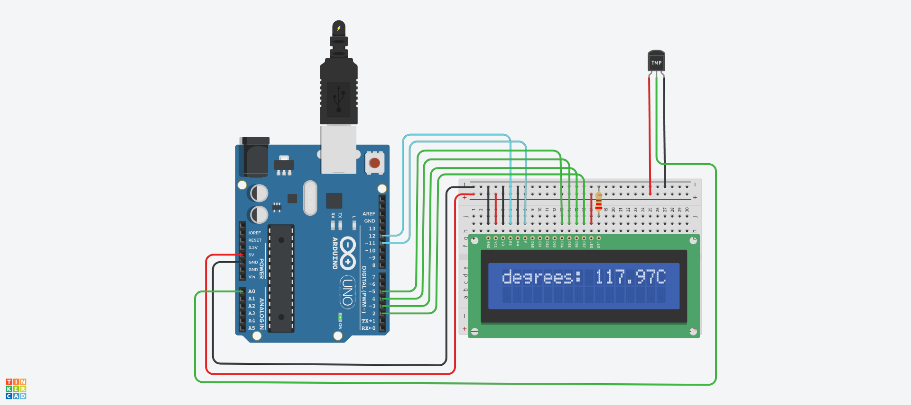

```c
/* 3핀 초음파센서 활용 */
int ultra = 7; // 출력 단자

void setup(){
  Serial.begin(9600);
}
void loop(){
  pinMode(ultra, OUTPUT);  
  //sig핀 기본출력설정
  digitalWrite(ultra, LOW);
  delay(1); // Wait for 100 millisecond(s), 
  
  digitalWrite(ultra, HIGH);
  delayMicroseconds(10);//센서를 동작하기 위한 시작신호로
  // sig핀에 5us동안 high신호 출력후 low출력
  digitalWrite(ultra, LOW);
  
  pinMode(ultra, INPUT);  
  
  //ultra 핀이 HIGH를 유지한 시간을 저장
  unsigned long duration = pulseIn(ultra, HIGH);
  
  //HIGH였을땨 시간(초음파가 보냈다가 다시 돌아온 시간)을 가지고 거리계산
  //초음파는 340m/s속도로 이동함에 따라(25도씨 기준)
  //이때 속도와 센서가 보낸 시간을 이용하여 거리를 계산
  //왕복해서 오는것이므로 결과를 2로 나누어 줌
  double dist = ((340*duration)/10000)/2;
    
  Serial.print("Distance:  ");
  Serial.print(dist);
  Serial.println("cm");
  delay(100);
}
```



```c
/*거리에 따라 LED 표시*/

int trig = 2;          
int echo = 3;
int RED = 8;       
int YELLOW = 9;     
int GREEN = 10;    

void setup()
{
  Serial.begin(9600);
  pinMode(trig, OUTPUT);
  pinMode(echo, INPUT);
  pinMode(RED, OUTPUT);     
  pinMode(YELLOW, OUTPUT);
  pinMode(GREEN, OUTPUT);
}

void loop()
{
  digitalWrite(trig, HIGH);
  delayMicroseconds(10);
  digitalWrite(trig, LOW);

  // echoPin 이 HIGH를 유지한 시간을 저장 한다.
  unsigned long duration = pulseIn(echo, HIGH); 
  // HIGH 였을 때 시간(초음파가 보냈다가 다시 들어온 시간)을 가지고 거리를 계산 한다.
  float distance = ((float)(340 * duration) / 10000) / 2;  
  
  Serial.print(distance);
  Serial.println("cm");
  delay(100);
  if (distance > 80)  //   distance(거리) 가 80보다 크면
  {
    digitalWrite(GREEN, HIGH);     // GREEN이 연결된 핀에 HIGH 신호(5V)를,
    digitalWrite(YELLOW, LOW);    // YELLOW가 연결된 핀에 LOW 신호(0V)를,
    digitalWrite(RED, LOW);       // RED가 연결된 핀에 LOW신호(0V)를.
  }
  if (distance > 30 & distance <= 70)  
  {
    digitalWrite(GREEN, LOW);   
    digitalWrite(YELLOW, HIGH);
    digitalWrite(RED, LOW);
  }
  if (distance > 0 & distance <= 30)
  {
    digitalWrite(GREEN, LOW);
    digitalWrite(YELLOW, LOW);
    digitalWrite(RED, HIGH);
  }
}
```



```c
int baselineTemp = 0;

int celsius = 0;

int fahrenheit = 0;

void setup()
{
  pinMode(A0, INPUT);
  Serial.begin(9600);
  pinMode(2, OUTPUT);
  pinMode(3, OUTPUT);
  pinMode(4, OUTPUT);
}

void loop()
{
  // set threshold temperature to activate LEDs
  baselineTemp = 40;
  // measure temperature in Celsius
  celsius = map(((analogRead(A0) - 20) * 3.04), 0, 1023, -40, 125);
  // convert to Fahrenheit
  fahrenheit = ((celsius * 9) / 5 + 32);
  Serial.print(celsius);
  Serial.print(" C, ");
  Serial.print(fahrenheit);
  Serial.println(" F");
  if (celsius < baselineTemp) {
    digitalWrite(2, LOW);
    digitalWrite(3, LOW);
    digitalWrite(4, LOW);
  }
  if (celsius >= baselineTemp && celsius < baselineTemp + 10) {
    digitalWrite(2, HIGH);
    digitalWrite(3, LOW);
    digitalWrite(4, LOW);
  }
  if (celsius >= baselineTemp + 10 && celsius < baselineTemp + 20) {
    digitalWrite(2, HIGH);
    digitalWrite(3, HIGH);
    digitalWrite(4, LOW);
  }
  if (celsius >= baselineTemp + 20 && celsius < baselineTemp + 30) {
    digitalWrite(2, HIGH);
    digitalWrite(3, HIGH);
    digitalWrite(4, HIGH);
  }
  if (celsius >= baselineTemp + 30) {
    digitalWrite(2, HIGH);
    digitalWrite(3, HIGH);
    digitalWrite(4, HIGH);
  }
  delay(1000); // Wait for 1000 millisecond(s)
}
```



```c
#include <LiquidCrystal.h>

LiquidCrystal lcd(12, 11, 5, 4, 3, 2);

void setup() {
  lcd.begin(16, 2);
}

void loop() {
  int reading = analogRead(A0); 
  // read value returned by temperature sensor at analog input A0
  
  float voltage = reading * 5.0; 
  // converting that reading to voltage
  voltage /= 1024.0; 
  
  float temperatureC = (voltage - 0.5) * 100 ;  
  //converting from 10 mv per degree wit 500 mV 
  //offset to degrees ((voltage - 500mV) times 100)
  
  lcd.setCursor(0,0); // set cursor at top left of the display
  lcd.clear();
  lcd.print("degrees: ");
  lcd.print(temperatureC);
  lcd.print("C");
  
  delay(500);
}
```
