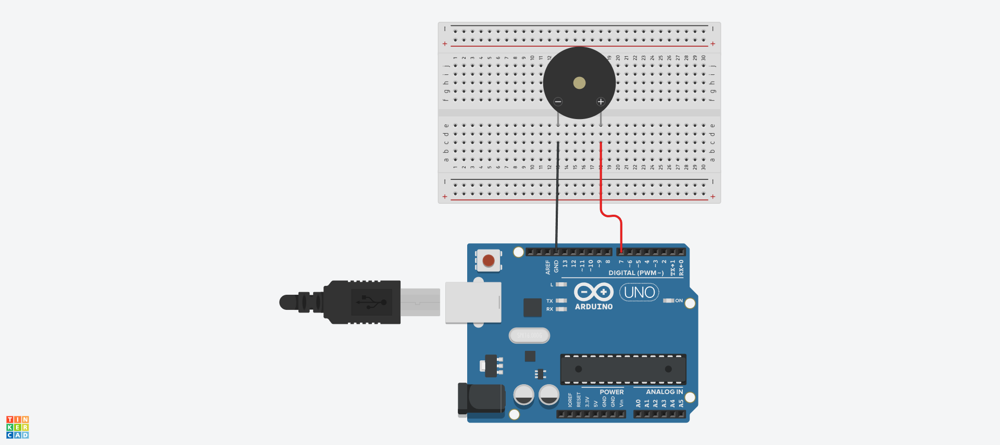
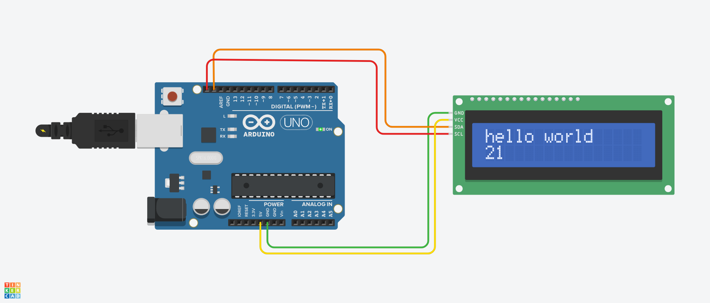
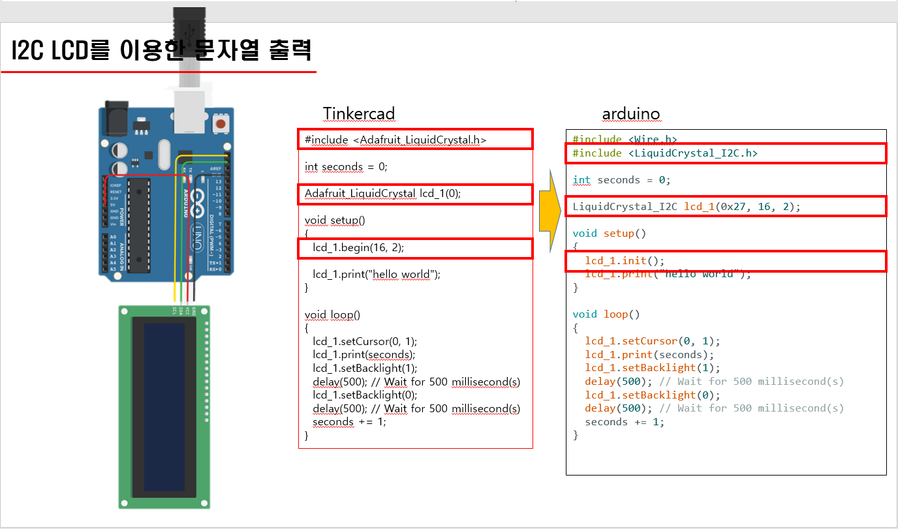
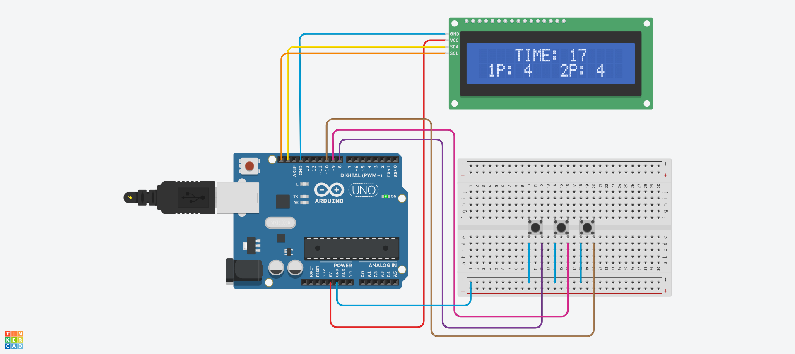
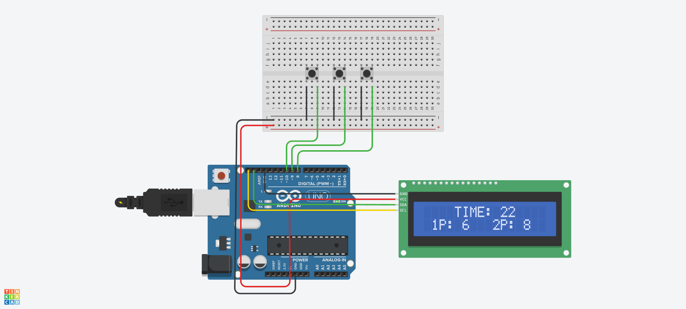
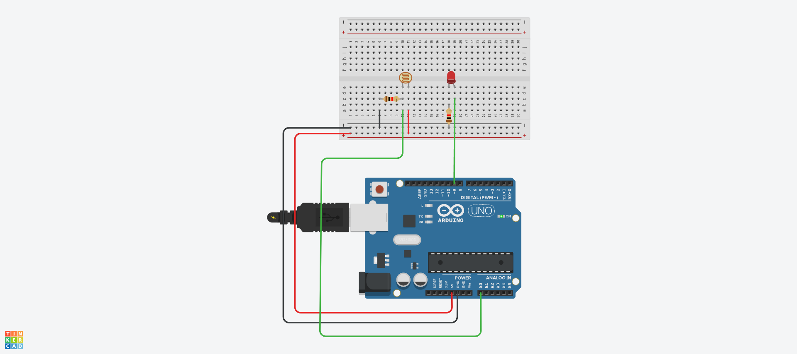

```c
void setup() {
  pinMode(3, OUTPUT);
}

void loop(){
  tone(7, 262, 1000);
  delay(500);
  tone(7, 294, 1000);
  delay(500);
  tone(7, 330, 1000);
  delay(500);
  tone(7, 349, 1000);
  delay(500);
  tone(7, 392, 1000);
  delay(500);
  tone(7, 440, 1000);
  delay(500);
  tone(7, 494, 1000);
  delay(500);
```
```c
const int piezo = 7;
char code[] = {'C', 'D', 'E', 'F', 'G', 'A', 'B'};
unsigned int freq[] = {262, 294, 330, 349, 392, 440, 494};
char mData[] = "CCGGAAGpFFEEDCCpGGFFEEDpGGFFEEDpCCGGAAGpFFEEDDCp";
const byte mSize = sizeof(mData);
void setup() {
   pinMode(piezo, OUTPUT);
}

void loop() {
  int playT = 200;
  for(int m=0; m<mSize; m++) {
    for(int k=0; k<7; k++) {
      if(mData[m] == code[k]) tone(piezo, freq[k], playT);
    }
    delay(playT);
  }
  noTone(piezo);
  delay(2000);
}
```



```c
#include <Wire.h>
#include <LiquidCrystal_I2C.h>

// 여기 주소를 스캔 결과에 맞게 수정하세요.
LiquidCrystal_I2C lcd(0x27, 16, 2);

void setup(){
  lcd.init();      // LCD 초기화
  lcd.backlight();  // 백라이트 켜기
  lcd.print("Hello, I2C!");
  }

  void loop() {
    // 할 일 없음
  }
```


#Tinkercad
```c
#include <Adafruit_LiquidCrystal.h>

int seconds = 0;

Adafruit_LiquidCrystal lcd_1(0);

void setup()
{
  lcd_1.begin(16, 2);

  lcd_1.print("hello world");
}

void loop()
{
  lcd_1.setCursor(0, 1);
  lcd_1.print(seconds);
  lcd_1.setBacklight(1);
  delay(500); // Wait for 500 millisecond(s)
  lcd_1.setBacklight(0);
  delay(500); // Wait for 500 millisecond(s)
  seconds += 1;
}
```
#arduino
```c
#include <LiquidCrystal_I2C.h>

int seconds = 0;

LiquidCrystal_I2C lcd_1(0x27, 16, 2);

void setup()
{
  lcd_1.init();

  lcd_1.print("hello world");
}

void loop()
{
  lcd_1.setCursor(0, 1);
  lcd_1.print(seconds);
  lcd_1.setBacklight(1);
  delay(500); // Wait for 500 millisecond(s)
  lcd_1.setBacklight(0);
  delay(500); // Wait for 500 millisecond(s)
  seconds += 1;
}
```



```c
#include <LiquidCrystal_I2C.h>

#define BUTTON_1P 10
#define BUTTON_2P 9
#define BUTTON_START 8

LiquidCrystal_I2C lcd(0x27, 16, 2);

unsigned int buttonCnt1 = 0;
unsigned int buttonCnt2 = 0;

unsigned long currTime = 0;
unsigned long prevTime = 0;

unsigned int gameTime = 30;

void setup() {
  pinMode(BUTTON_1P, INPUT_PULLUP);
  pinMode(BUTTON_2P, INPUT_PULLUP);
  pinMode(BUTTON_START, INPUT_PULLUP);
  lcd.init();
  lcd.backlight(); 
}

void loop() {
  if(button1P() == 1) {
    if(gameTime > 0 ) buttonCnt1++;
    delay(50);
  }
  if(button2P() == 1) {
    if(gameTime > 0 ) buttonCnt2++;
    delay(50);
  }
   if(buttonStart() == 1){
    gameTime = 30;
    buttonCnt1 = 0;
    buttonCnt2 = 0;
    delay(50);
  }

  currTime = millis();
  if(currTime - prevTime >= 1000) {
    prevTime = currTime;
    if(gameTime > 0) gameTime--;
    lcd.clear();
    lcd.setCursor(3, 0);
    lcd.print(" TIME: ");
    lcd.print(gameTime);
    lcd.setCursor(0, 1);
    lcd.print(" 1P: ");
    lcd.print(buttonCnt1);
    lcd.setCursor(8, 1);
    lcd.print(" 2P: ");
    lcd.print(buttonCnt2);
  }
}
int button1P() {
  static int oldSw = 1;
  static int newSw = 1;
  newSw = digitalRead(BUTTON_1P);
  if (newSw != oldSw) {
    oldSw = newSw;
    if(newSw == 0) {
      return 1;
    }
  }
  return 0;
}
int button2P() {
  static int oldSw = 1;
  static int newSw = 1;
  newSw = digitalRead(BUTTON_2P);
  if (newSw != oldSw) {
    oldSw = newSw;
    if(newSw == 0) {
      return 1;
    }
  }
  return 0;
}
int buttonStart() {
  static int oldSw = 1;
  static int newSw = 1;
  newSw = digitalRead(BUTTON_START);
  if (newSw != oldSw) {
    oldSw = newSw;
    if(newSw == 0) {
      return 1;
    }
  }
  return 0;
}
```



```c
#include <Adafruit_LiquidCrystal.h>

#define BUTTON_1P 10
#define BUTTON_2P 9
#define BUTTON_START 8

Adafruit_LiquidCrystal lcd(0);

unsigned int buttonCnt1 = 0;
unsigned int buttonCnt2 = 0;

unsigned long currTime = 0;
unsigned long prevTime = 0;

unsigned int gameTime = 30;

void setup() {
  pinMode(BUTTON_1P, INPUT_PULLUP);
  pinMode(BUTTON_2P, INPUT_PULLUP);
  pinMode(BUTTON_START, INPUT_PULLUP);
  lcd.begin(16, 2);
}

void loop() {
  if(button1P() == 1) {
    if(gameTime > 0 ) buttonCnt1++;
    delay(50);
  }
  if(button2P() == 1) {
    if(gameTime > 0 ) buttonCnt2++;
    delay(50);
  }
 if(buttonStart() == 1){
    gameTime = 30;
    buttonCnt1 = 0;
    buttonCnt2 = 0;
    delay(50);
  }

  currTime = millis();
  if(currTime - prevTime >= 1000) {
    prevTime = currTime;
    if(gameTime > 0) gameTime--;
    lcd.clear();
    lcd.setCursor(3, 0);
    lcd.print(" TIME: ");
    lcd.print(gameTime);
    lcd.setCursor(0, 1);
    lcd.print(" 1P: ");
    lcd.print(buttonCnt1);
    lcd.setCursor(8, 1);
    lcd.print(" 2P: ");
    lcd.print(buttonCnt2);
  }
}
int button1P() {
  static int oldSw = 1;
  static int newSw = 1;
  newSw = digitalRead(BUTTON_1P);
  if (newSw != oldSw) {
    oldSw = newSw;
    if(newSw == 0) {
      return 1;
    }
  }
  return 0;
}
int button2P() {
  static int oldSw = 1;
  static int newSw = 1;
  newSw = digitalRead(BUTTON_2P);
  if (newSw != oldSw) {
    oldSw = newSw;
    if(newSw == 0) {
      return 1;
    }
  }
  return 0;
}
int buttonStart() {
  static int oldSw = 1;
  static int newSw = 1;
  newSw = digitalRead(BUTTON_START);
  if (newSw != oldSw) {
    oldSw = newSw;
    if(newSw == 0) {
      return 1;
    }
  }
  return 0;
}
```


```c
void setup()
{
  pinMode(9, OUTPUT); 
}

void loop()
{
  int val1 = analogRead(0);
  int val2 = map(val1, 0, 1023, 0, 255);
  
  analogWrite(9, val2);
  delay(20);
}
```

```c
int sensorValue = 0;

void setup()
{
  pinMode(A0, INPUT);
  Serial.begin(9600);
  pinMode(9, OUTPUT);
}

void loop()
{
  // read the value from the sensor
  sensorValue = analogRead(A0);
  // print the sensor reading so you know its range
  Serial.println(sensorValue);
  // map the sensor reading to a range for the LED
  analogWrite(9, map(sensorValue, 0, 1023, 0, 255));
  delay(100); // Wait for 100 millisecond(s)
}
```



```c
int sensorPin = A0;  //아날로그 핀은 입력 명시하지 않아도 됨.
int ledPin = 9;  // PWM
int lightLevel;


void setup()
{
    pinMode(ledPin, OUTPUT); 
}


void loop()
{
    lightLevel = analogRead(sensorPin); 
    adjustBrightness(); //LED 밝기 조절 함수
    analogWrite(ledPin, lightLevel); 
}


void adjustBrightness()
{
    lightLevel = map(lightLevel, 500, 1023, 0, 255);
    lightLevel = constrain(lightLevel, 0, 255);
      //lightlevel이 0보다 작으면 0을 출력 
      //255보다 크면 255를 출력, 0~255사이의 숫자면 그대로 출력
}
```
