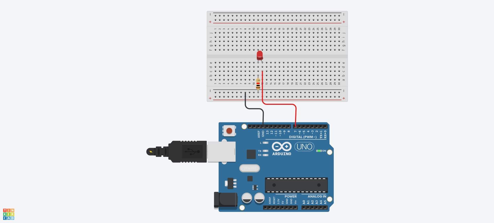

## LED 깜박이기
## a와 b로 LED 켜고 끄기




```c
void setup() {
   Serial.begin(9600);
   pinMode(7,OUTPUT);
}
   
void loop() {
  if( Serial.available() > 0)
  {
    char sData = Serial.read();
    if(sData == 'a')
    {
      digitalWrite(7,HIGH);
    }
    else if(sData == 'b')
    {
      digitalWrite(7,LOW);
    }
  }
}
```
