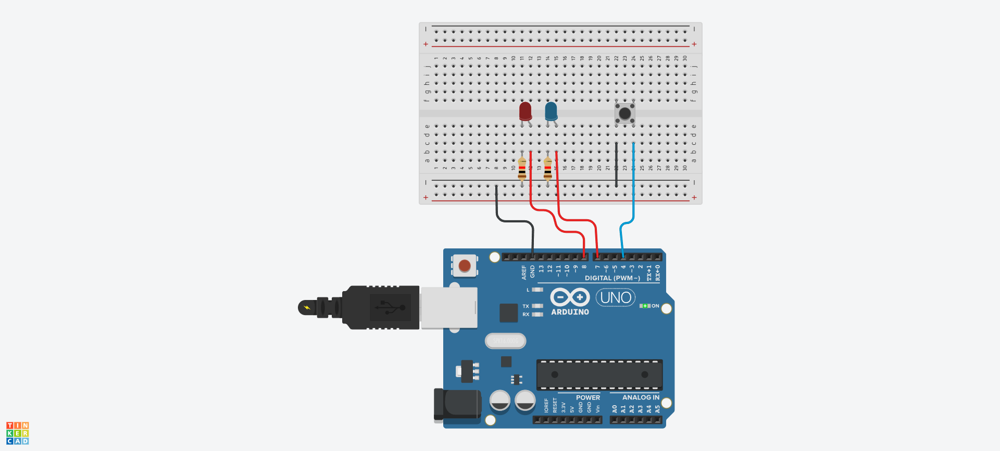
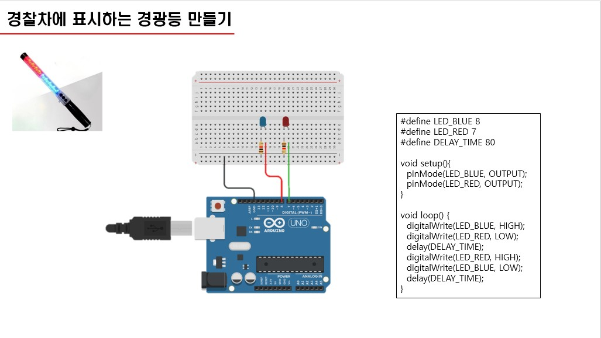

## LED 깜박이기


```c
void setup() {
   Serial.begin(9600);
   pinMode(7,OUTPUT);
}
   
void loop() {
  if( Serial.available() > 0)
  {
    char sData = Serial.read();
    if(sData == 'a')
    {
      digitalWrite(7,HIGH);
    }
    else if(sData == 'b')
    {
      digitalWrite(7,LOW);
    }
  }
}
```


## a와 b로 LED 켜고 끄기


```c
#define LED1 8
#define LED2 7
#define LED3 6
void setup(){
  pinMode(LED1, OUTPUT);
  pinMode(LED2, OUTPUT);
  pinMode(LED3, OUTPUT);
}
void loop() {
  digitalWrite(LED1,HIGH);
  digitalWrite(LED2,HIGH);
  digitalWrite(LED3,HIGH);
  delay(1000);
  digitalWrite(LED1,LOW);
  digitalWrite(LED2,LOW);
  digitalWrite(LED3,LOW);
  delay(1000);
}
```


## 버튼으로 
## RED, BLUE LED 번갈아 깜박이기



```c
#define BUTTON 4
#define LED_BLUE 8
#define LED_RED 7
#define DELAY_TIME 80

int state = 0;

void setup() {
  Serial.begin(9600);
  pinMode(BUTTON, INPUT_PULLUP);
  pinMode(LED_BLUE,OUTPUT);
  pinMode(LED_RED,OUTPUT);
}
void loop(){
int buttonValue = !digitalRead(BUTTON);
  
  if(buttonValue == 1) {
    state = !state;
    delay(500);
  }
  
  if(state == 0){
   digitalWrite(LED_BLUE,HIGH); 
   digitalWrite(LED_RED,LOW);  
   delay(DELAY_TIME);      
   digitalWrite(LED_RED,HIGH); 
   digitalWrite(LED_BLUE,LOW);  
   delay(DELAY_TIME);      
  }
  else if(state == 1){
   digitalWrite(LED_BLUE,LOW);  
   digitalWrite(LED_RED,LOW);   
  }  
}
```



