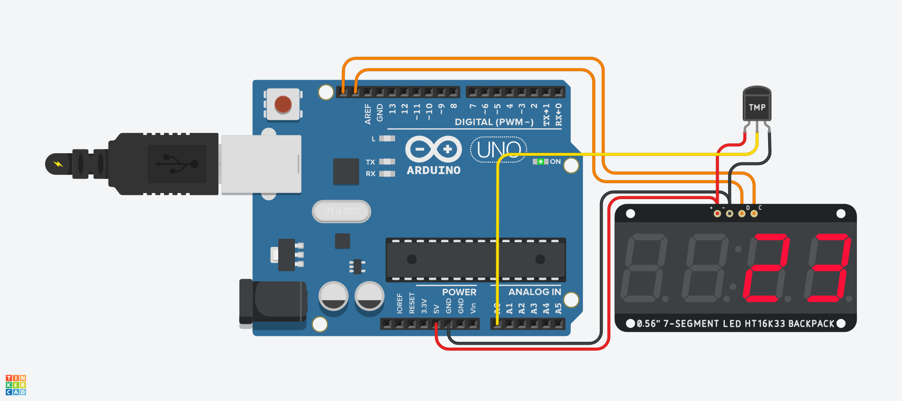
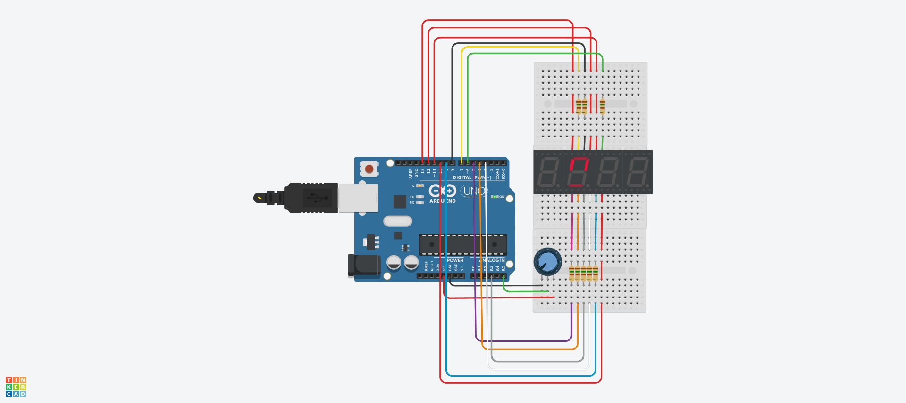

```c
void setup() 
{
  pinMode(9, OUTPUT);
}
void loop()
{
  Serial.begin(9600);
  int inputValue = analogRead(A0);
  Serial.println(inputValue);
  int convertedValue = map(inputValue, 0, 1023, 0, 255);

  analogWrite(9, convertedValue);
  delay(100);
}
```


```c
void setup() 
{
  pinMode(9, OUTPUT);
  pinMode(10, OUTPUT);
  pinMode(8, INPUT);
}
void loop()
{
  int inputValue = analogRead(A0);
  Serial.println(inputValue);
  int convertedValue = map(inputValue, 0, 1023, 0, 255);

  int inputSwitch = digitalRead(8);
  if(inputSwitch == LOW) {	
    analogWrite(9, convertedValue);
    analogWrite(10, 0);
  }
  else {
    analogWrite(9, 0);
    analogWrite(10, convertedValue);
  }   
  delay(100);
}
```


```c
const int MOTOR_PIN_A = 5;
const int MOTOR_PIN_B = 6;

void setup() 
{
  pinMode(MOTOR_PIN_A, OUTPUT);
  pinMode(MOTOR_PIN_B, OUTPUT);
}
void loop()
{
  int readValue = digitalRead(4);

  if(readValue == LOW) {	
    analogWrite(MOTOR_PIN_A, 255);
    analogWrite(MOTOR_PIN_B, 0);
  }
  else {
    analogWrite(MOTOR_PIN_A, 0);
    analogWrite(MOTOR_PIN_B, 255);
  }   
  delay(100);
}
```


```c
// Motor A connections
int enA = 9;
int in1 = 8;
int in2 = 7;
// Motor B connections
int enB = 3;
int in3 = 5;
int in4 = 4;

void setup() {
	// Set all the motor control pins to outputs
	pinMode(enA, OUTPUT);
	pinMode(enB, OUTPUT);
	pinMode(in1, OUTPUT);
	pinMode(in2, OUTPUT);
	pinMode(in3, OUTPUT);
	pinMode(in4, OUTPUT);
	
	// Turn off motors - Initial state
	digitalWrite(in1, LOW);
	digitalWrite(in2, LOW);
	digitalWrite(in3, LOW);
	digitalWrite(in4, LOW);
}

void loop() {
	directionControl();
	delay(1000);
	speedControl();
	delay(1000);
}
// This function lets you control spinning direction of motors
void directionControl() {
	// Set motors to maximum speed
	// For PWM maximum possible values are 0 to 255
	analogWrite(enA, 255);
	analogWrite(enB, 255);

	// Turn on motor A & B
	digitalWrite(in1, HIGH);
	digitalWrite(in2, LOW);
	digitalWrite(in3, HIGH);
	digitalWrite(in4, LOW);
	delay(2000);
	
	// Now change motor directions
	digitalWrite(in1, LOW);
	digitalWrite(in2, HIGH);
	digitalWrite(in3, LOW);
	digitalWrite(in4, HIGH);
	delay(2000);
	
	// Turn off motors
	digitalWrite(in1, LOW);
	digitalWrite(in2, LOW);
	digitalWrite(in3, LOW);
	digitalWrite(in4, LOW);
}
// This function lets you control speed of the motors
void speedControl() {
	// Turn on motors
	digitalWrite(in1, LOW);
	digitalWrite(in2, HIGH);
	digitalWrite(in3, LOW);
	digitalWrite(in4, HIGH);
	
	// Accelerate from zero to maximum speed
	for (int i = 0; i < 256; i++) {
		analogWrite(enA, i);
		analogWrite(enB, i);
		delay(20);
	}
	
	// Decelerate from maximum speed to zero
	for (int i = 255; i >= 0; --i) {
		analogWrite(enA, i);
		analogWrite(enB, i);
		delay(20);
	}
	
	// Now turn off motors
	digitalWrite(in1, LOW);
	digitalWrite(in2, LOW);
	digitalWrite(in3, LOW);
	digitalWrite(in4, LOW);
}
```


```c
#include <Encoder.h>	
//use the Encoder library
Encoder encoder(2,3);	
//create the encoder (always use pins 2 and 3 on UNO)
long position = 0;	
//current motor position (10 steps per revolution)
int rotation = 0;	
//current number of revolutions from 0 point

void setup()
{
  Serial.begin(9600);
  pinMode(5, OUTPUT);
  pinMode(6, OUTPUT);
}
void loop()
{
  //spin the motor
  analogWrite(5, 30);
  analogWrite(6,0);
  
  //get the current encoder position
  position = encoder.read() / 10;
  
  //calculate the number of complete rotations
  rotation = abs(position) / 10;
  
  //print results
  Serial.print("pos: ");
  Serial.println(position);
  Serial.print("rot: ");
  Serial.println(rotation);
}
```


```c
Sweep
  by BARRAGAN <http://barraganstudio.com>
  This example code is in the public domain.
  modified 8 Nov 2013  by Scott Fitzgerald
  http://www.arduino.cc/en/Tutorial/Sweep
*/
#include <Servo.h>

int pos = 0;
Servo servo_9;
void setup()
{
  servo_9.attach(9, 500, 2500);
}

void loop()
{
  // sweep the servo from 0 to 180 degrees in steps
  // of 1 degrees
  for (pos = 0; pos <= 180; pos += 1) {
    // tell servo to go to position in variable 'pos'
    servo_9.write(pos);
    // wait 15 ms for servo to reach the position
    delay(15); // Wait for 15 millisecond(s)
  }
  for (pos = 180; pos >= 0; pos -= 1) {
    // tell servo to go to position in variable 'pos'
    servo_9.write(pos);
    // wait 15 ms for servo to reach the position
    delay(15); // Wait for 15 millisecond(s)
  }
}
```


```c
#include <Servo.h> //use library <Servo.h> (1m)
Servo myservo; //name the pin of servo motor as myservo (1m)

//int angle = 0; //current angle
//int direc = 0; //currrent direction;0=clockwise;1=anti-clockwise

void setup(){
  myservo.attach(6); //pwm to D6
}

void loop(){
  for(int ang=0; ang<180; ang++){ //clockwise
    myservo.write(ang); //rotate pin of servo motor (1m) 
    delay(50); //for 0.05 second (1m)
  }
  for(int ang=180; ang>0; ang--){ //anti-clockwise
    myservo.write(ang);
    delay(50);
  }
}

```


```c
#include <Servo.h>

Servo servo_5;
Servo servo_4;
Servo servo_3;
Servo servo_2;

void setup()
{
  pinMode(A3, INPUT);
  servo_5.attach(11);

  pinMode(A2, INPUT);
  servo_4.attach(10);

  pinMode(A1, INPUT);
  servo_3.attach(9);

  pinMode(A0, INPUT);
  servo_2.attach(8);

}

void loop()
{
  servo_5.write(map(analogRead(A3), 0, 1023, 0, 180));
  servo_4.write(map(analogRead(A2), 0, 1023, 0, 180));
  servo_3.write(map(analogRead(A1), 0, 1023, 0, 180));
  servo_2.write(map(analogRead(A0), 0, 1023, 0, 180));
  delay(10); // Delay a little bit to improve simulation performance
}

```


```c
#include <Servo.h>
Servo servoMotor;
int potPos;

void setup() {
  servoMotor.attach(9);
}
void loop () {
  potPos = map(analogRead(A0), 0, 1023, 0, 180);
  servoMotor.write(potPos);
  delay(15);
}
```


```c
int index = 0;

int counter;

String pattern[]=
{   
"00100001",   
"11111001",   
"00010011",   
"01010001",   
"11001001",   
"01000101",   
"00000101",   
"11110001",   
"00000001",   
"01000001",   
}; 
 
void clear()
{
  index = 0;
  for (counter = 0; counter < 8; ++counter) {
    analogWrite(index+2, 255);
    index++;
  }
}
void display(int num)
{
  clear();
  index = 0;
  for (counter = 0; counter < 8; ++counter) {
    if (pattern[num].substring(index,index+1)=="0"){
      analogWrite(index+2, 0);
    }
    index++;
  }
}

void setup()
{
  pinMode(2, OUTPUT);
  pinMode(3, OUTPUT);
  pinMode(4, OUTPUT);
  pinMode(5, OUTPUT);
  pinMode(6, OUTPUT);
  pinMode(7, OUTPUT);
  pinMode(8, OUTPUT);	
  pinMode(9, OUTPUT);
display(9);
  delay(1000);
  display(8);
  delay(1000);
  display(7);
  delay(1000);
  display(6);
  delay(1000);
  display(5);
  delay(1000);
  display(4);
  delay(1000);
  display(3);
  delay(1000);
  display(2);
  delay(1000);
  display(1);
  delay(1000);
  display(0);
  tone(10,523,500);
}

void loop()
{
}
```


```c
// C++ code
//
#include "Adafruit_LEDBackpack.h"
Adafruit_7segment led_display1 = Adafruit_7segment();
Adafruit_7segment led_display2 = Adafruit_7segment();

int analogpin=0,range;

void setup()
{
  pinMode(analogpin, INPUT_PULLUP);
  led_display1.begin(112);
}

void loop()
{
  int val;
  val=analogRead(analogpin);
  range=map(val,20,358,-40,125);
  led_display1.println(range);
  led_display1.writeDisplay();
  led_display1.println(range);
  led_display1.writeDisplay();
}
```


```c
/* 6-13-2011  Spark Fun Electronics 2011  -- Nathan Seidle */
int digit1 = 13; //PWM Display pin 1
int digit2 = 12; //PWM Display pin 2
int digit3 = 11; //PWM Display pin 6
int digit4 = 10; //PWM Display pin 8

//Pin mapping 
int segA = 7; //Display pin 14
int segB = 6; //Display pin 16
int segC = 3; //Display pin 13
int segD = 4; //Display pin 3
int segE = 5; //Display pin 5
int segF = 8; //Display pin 11
int segG = 9; //Display pin 15
int segDP = 2;
void setup() {                
  pinMode(segA, OUTPUT);
  pinMode(segB, OUTPUT);
  pinMode(segC, OUTPUT);
  pinMode(segD, OUTPUT);
  pinMode(segE, OUTPUT);
  pinMode(segF, OUTPUT);
  pinMode(segG, OUTPUT);
  pinMode(digit1, OUTPUT);
  pinMode(digit2, OUTPUT);
  pinMode(digit3, OUTPUT);
  pinMode(digit4, OUTPUT);
  pinMode(13, OUTPUT);  //Builtin LED
}
void loop() 
{
  displayNumber( analogRead(5) );
}
void displayNumber(int toDisplay) {
#define DISPLAY_BRIGHTNESS  500

#define DIGIT_ON  HIGH
#define DIGIT_OFF  LOW

  long beginTime = millis();

  for(int digit = 4 ; digit > 0 ; digit--) {

    //Turn on a digit for a short amount of time
    switch(digit) {
    case 1:
      digitalWrite(digit1, DIGIT_ON);
      break;
    case 2:
      digitalWrite(digit2, DIGIT_ON);
      break;
    case 3:
      digitalWrite(digit3, DIGIT_ON);
      break;
    case 4:
      digitalWrite(digit4, DIGIT_ON);
      break;
    }
//Turn on the right segments for this digit
    lightNumber(toDisplay % 10);
    toDisplay /= 10;

    delayMicroseconds(DISPLAY_BRIGHTNESS); //Display this digit for a fraction of a second (between 1us and 5000us, 500 is pretty good)

    //Turn off all segments
    lightNumber(10); 

    //Turn off all digits
    digitalWrite(digit1, DIGIT_OFF);
    digitalWrite(digit2, DIGIT_OFF);
    digitalWrite(digit3, DIGIT_OFF);
    digitalWrite(digit4, DIGIT_OFF);
  }

  while( (millis() - beginTime) < 10) ; //Wait for 20ms to pass before we paint the display again
}
//Given a number, turns on those segments
//If number == 10, then turn off number
void lightNumber(int numberToDisplay) {

#define SEGMENT_ON  LOW
#define SEGMENT_OFF HIGH

  switch (numberToDisplay){

  case 0:
    digitalWrite(segA, SEGMENT_ON);
    digitalWrite(segB, SEGMENT_ON);
    digitalWrite(segC, SEGMENT_ON);
    digitalWrite(segD, SEGMENT_ON);
    digitalWrite(segE, SEGMENT_ON);
    digitalWrite(segF, SEGMENT_ON);
    digitalWrite(segG, SEGMENT_OFF);
    break;

  case 1:
    digitalWrite(segA, SEGMENT_OFF);
    digitalWrite(segB, SEGMENT_ON);
    digitalWrite(segC, SEGMENT_ON);
    digitalWrite(segD, SEGMENT_OFF);
    digitalWrite(segE, SEGMENT_OFF);
    digitalWrite(segF, SEGMENT_OFF);
    digitalWrite(segG, SEGMENT_OFF);
    break;
  case 2:
    digitalWrite(segA, SEGMENT_ON);
    digitalWrite(segB, SEGMENT_ON);
    digitalWrite(segC, SEGMENT_OFF);
    digitalWrite(segD, SEGMENT_ON);
    digitalWrite(segE, SEGMENT_ON);
    digitalWrite(segF, SEGMENT_OFF);
    digitalWrite(segG, SEGMENT_ON);
    break;

  case 3:
    digitalWrite(segA, SEGMENT_ON);
    digitalWrite(segB, SEGMENT_ON);
    digitalWrite(segC, SEGMENT_ON);
    digitalWrite(segD, SEGMENT_ON);
    digitalWrite(segE, SEGMENT_OFF);
    digitalWrite(segF, SEGMENT_OFF);
    digitalWrite(segG, SEGMENT_ON);
    break;

  case 4:
    digitalWrite(segA, SEGMENT_OFF);
    digitalWrite(segB, SEGMENT_ON);
    digitalWrite(segC, SEGMENT_ON);
    digitalWrite(segD, SEGMENT_OFF);
    digitalWrite(segE, SEGMENT_OFF);
    digitalWrite(segF, SEGMENT_ON);
    digitalWrite(segG, SEGMENT_ON);
    break;
case 5:
    digitalWrite(segA, SEGMENT_ON);
    digitalWrite(segB, SEGMENT_OFF);
    digitalWrite(segC, SEGMENT_ON);
    digitalWrite(segD, SEGMENT_ON);
    digitalWrite(segE, SEGMENT_OFF);
    digitalWrite(segF, SEGMENT_ON);
    digitalWrite(segG, SEGMENT_ON);
    break;

  case 6:
    digitalWrite(segA, SEGMENT_ON);
    digitalWrite(segB, SEGMENT_OFF);
    digitalWrite(segC, SEGMENT_ON);
    digitalWrite(segD, SEGMENT_ON);
    digitalWrite(segE, SEGMENT_ON);
    digitalWrite(segF, SEGMENT_ON);
    digitalWrite(segG, SEGMENT_ON);
    break;

  case 7:
    digitalWrite(segA, SEGMENT_ON);
    digitalWrite(segB, SEGMENT_ON);
    digitalWrite(segC, SEGMENT_ON);
    digitalWrite(segD, SEGMENT_OFF);
    digitalWrite(segE, SEGMENT_OFF);
    digitalWrite(segF, SEGMENT_OFF);
    digitalWrite(segG, SEGMENT_OFF);
    break;
case 8:
    digitalWrite(segA, SEGMENT_ON);
    digitalWrite(segB, SEGMENT_ON);
    digitalWrite(segC, SEGMENT_ON);
    digitalWrite(segD, SEGMENT_ON);
    digitalWrite(segE, SEGMENT_ON);
    digitalWrite(segF, SEGMENT_ON);
    digitalWrite(segG, SEGMENT_ON);
    break;

  case 9:
    digitalWrite(segA, SEGMENT_ON);
    digitalWrite(segB, SEGMENT_ON);
    digitalWrite(segC, SEGMENT_ON);
    digitalWrite(segD, SEGMENT_ON);
    digitalWrite(segE, SEGMENT_OFF);
    digitalWrite(segF, SEGMENT_ON);
    digitalWrite(segG, SEGMENT_ON);
    break;
  case 10:
    digitalWrite(segA, SEGMENT_OFF);
    digitalWrite(segB, SEGMENT_OFF);
    digitalWrite(segC, SEGMENT_OFF);
    digitalWrite(segD, SEGMENT_OFF);
    digitalWrite(segE, SEGMENT_OFF);
    digitalWrite(segF, SEGMENT_OFF);
    digitalWrite(segG, SEGMENT_OFF);
    break;
  }
}
```

